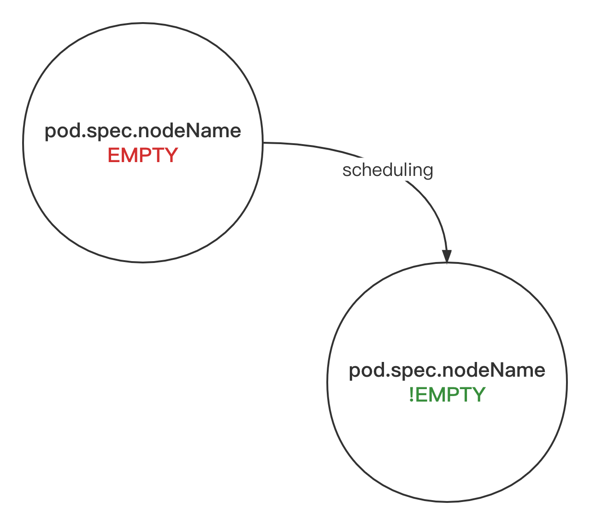

# Scheduling-related API/model reference

For scheduling concepts in Kubernetes, please refer to the official documentation, such as:
- [Kubernetes Scheduler](https://kubernetes.io/docs/concepts/scheduling-eviction/kube-scheduler/)
- [Scheduling Framework](https://kubernetes.io/docs/concepts/scheduling-eviction/scheduling-framework/)

Reduced **Pod** information considered (personally) as important for scheduling: [**V1Pod**](V1Pod.md).

Reduced **Node** information considered (personally) as important for scheduling: [**V1Node**](V1Node.md).

For exhaustive Pod and Node docs, please refer to [**FULLV1Pod**](../original/V1Pod.md) and [**FULLV1Node**](../original/V1Node.md)
